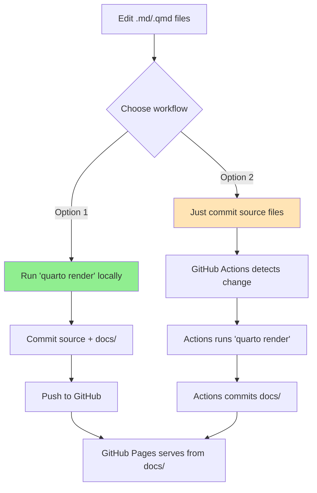

# GitHub Pages Setup Instructions

## Initial Setup

1. **Push your repository to GitHub**
   ```bash
   git remote add origin https://github.com/YOUR_USERNAME/Linguistic_Data_Analysis_I.git
   git push -u origin main
   ```

2. **Enable GitHub Pages**
   - Go to your repository on GitHub
   - Click **Settings** (top menu)
   - Scroll down to **Pages** (left sidebar)
   - Under **Source**, select:
     - **Deploy from a branch**
     - Branch: `main` (or `master`)
     - Folder: `/docs`
   - Click **Save**

3. **Wait for deployment**
   - Takes 2-10 minutes initially
   - Check Actions tab for progress
   - Green checkmark = deployed

4. **Access your site**
   - URL: `https://YOUR_USERNAME.github.io/Linguistic_Data_Analysis_I/`
   - Add this URL to your repo's About section

## How the Hybrid System Works



## Verify Everything Works

1. **Check GitHub Actions**
   - Go to **Actions** tab
   - You should see workflows:
     - "Auto-Render Quarto Site"
     - "Verify and Update Site"
   - Green = working

2. **Test the fallback**
   ```bash
   # Make a small edit
   echo "\n\nTest edit" >> resources/tools/index.md
   
   # Commit WITHOUT rendering
   git add resources/tools/index.md
   git commit -m "Test GitHub Actions rendering"
   git push
   
   # Watch Actions tab - should auto-render!
   ```

3. **Check the site**
   - Visit your GitHub Pages URL
   - Should see your content
   - Updates within minutes of pushing

## Customization

### Update URLs in _quarto.yml
```yaml
website:
  site-url: "https://YOUR_USERNAME.github.io/Linguistic_Data_Analysis_I/"
  repo-url: "https://github.com/YOUR_USERNAME/Linguistic_Data_Analysis_I"
```

### Update navbar GitHub link
```yaml
navbar:
  right:
    - icon: github
      href: "https://github.com/YOUR_USERNAME/Linguistic_Data_Analysis_I"
```

## Troubleshooting

**Site not appearing?**
- Check Settings → Pages → Source is set correctly
- Verify `docs/` folder exists and has index.html
- Check Actions tab for errors
- Wait 10 minutes (first deploy is slow)

**Actions failing?**
- Check Actions tab → Click failed workflow → View logs
- Common issues:
  - Syntax error in .qmd file
  - Missing file reference
  - YAML formatting error

**Changes not showing?**
- Hard refresh browser (Ctrl+Shift+R)
- Check if `docs/` was updated
- Verify GitHub Pages deployed (green checkmark)
- Clear browser cache

## Tips

1. **Render locally** for big changes
2. **Use Actions** for quick fixes
3. **Watch the Actions tab** to ensure builds succeed
4. **Tag releases** for each semester:
   ```bash
   git tag -a v2025-summer -m "Summer 2025 version"
   git push origin v2025-summer
   ```
