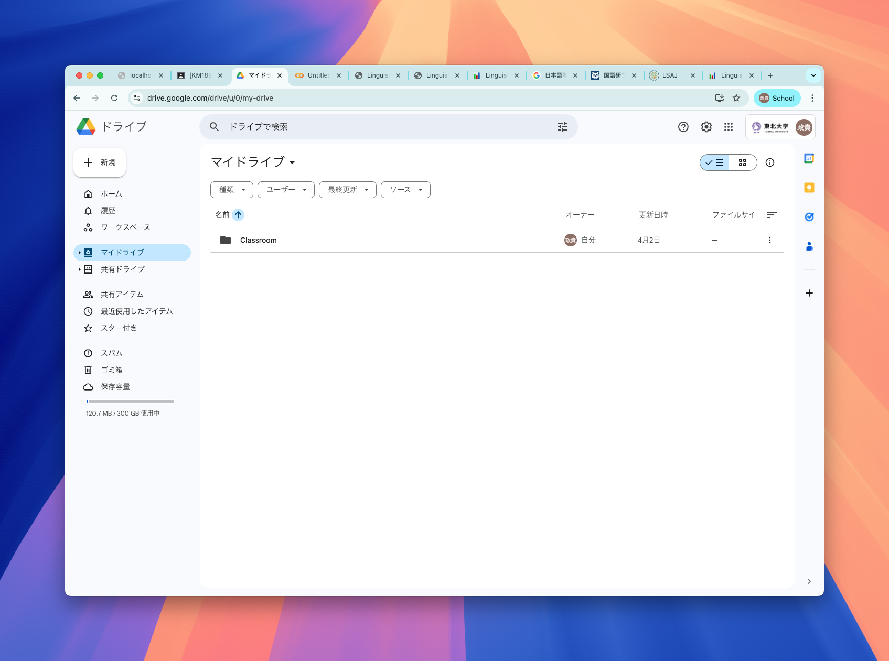
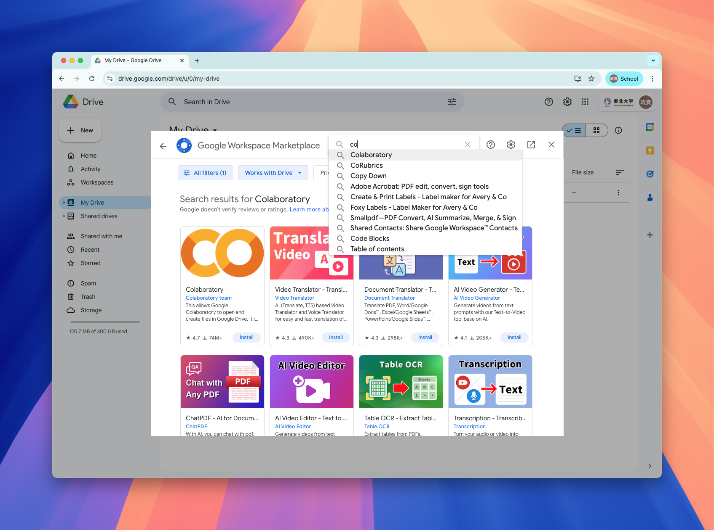
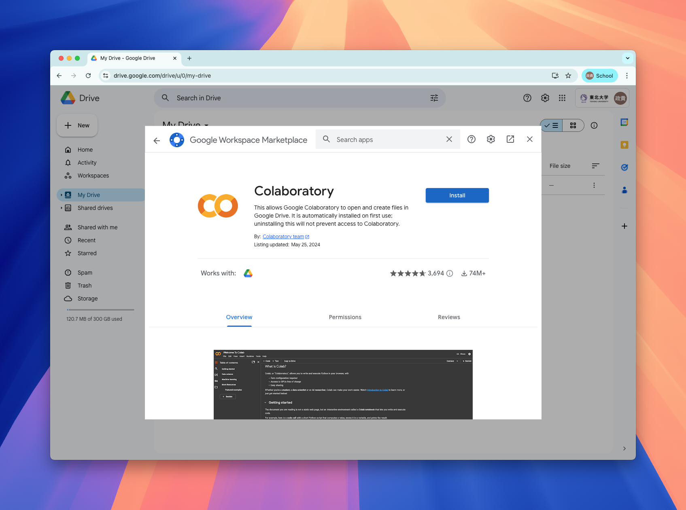
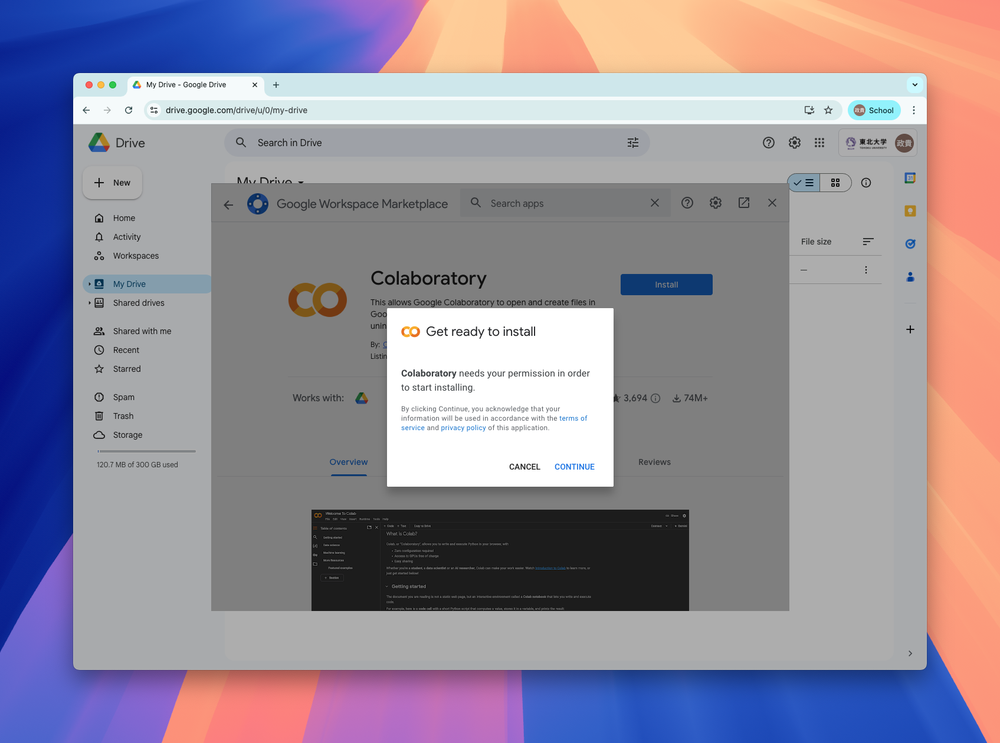
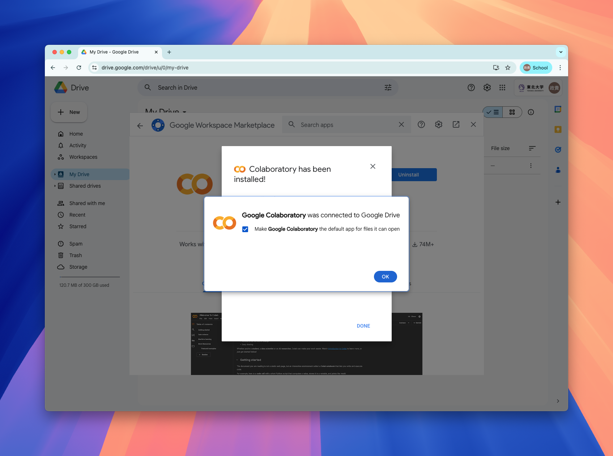
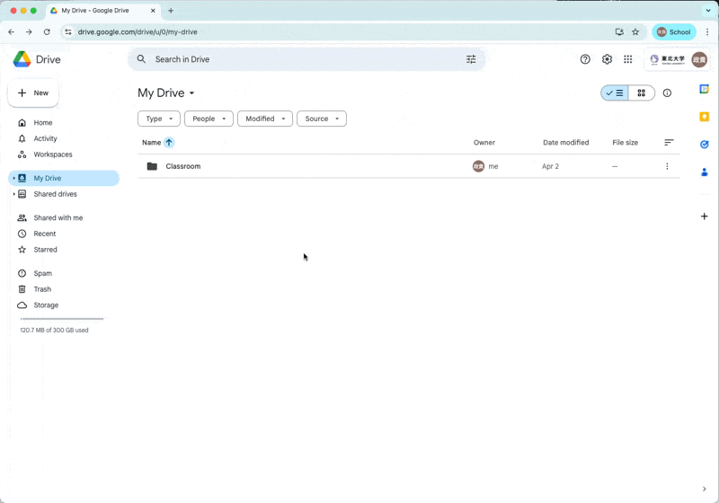

## Overview

In this 5-day intensive course, we will use Python through Google colaboratory, browser based environment that requires no installation on your local computer.

You can follow the step here to enable `Colaboratory` through your gmail account.

The following steps should be completed **before we start grammar analysis on Day 4**.

## Log in to your google account.

You will need a google account, so log in to your google account.

## Go to Google Drive

Go to google drive.

## Hit `new` and find `connect more apps`

## Search `Colaboratory` on the marketplace

## Install `Colaboratory`

Click on Colaboratory, and hit `install` button.

Hit continue when it prompts permission.

**Follow the instruction of the pop-up instruction.**

## Installation success!!

## Now you can create `google colab notebook` from Google Drive.

Now you can create a new google colab notebook.

